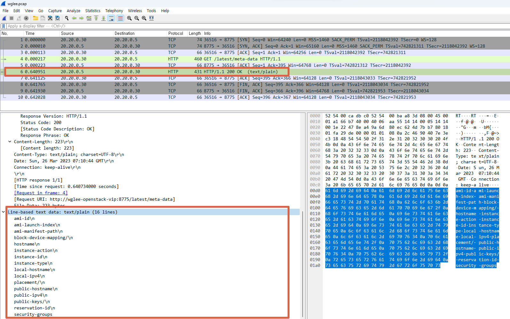

# How Nova instance retrieves Metadata in OpenStack?


본 게시글은 victoria 버전 기준으로 작성되었습니다.



## <mark style="color:blue;">OpenStack Metadata?</mark>

OpenStack에서 인스턴스는 부팅과정에서 cloud-init을 이용해 metadata server로부터 인스턴스의 다음과 같은 정보들을 제공 받는다.

* 공인 아이피
* hostname
* SSH public key
* cloud-init script
* user-data
* Static Routing 정보

가상서버에서 metadata를 받아오는데 사용하는 169.254.169.254 아이피로 curl을 하여 반환받은 metadata를 볼 수 있다.

```shell-session
root@wglee-controller-001:~# ssh -i .ssh/dvr3-key.pem ubuntu@183.10.10.77
The authenticity of host '183.10.10.77 (183.10.10.77)' can't be established.
ECDSA key fingerprint is SHA256:ESOc+KUkQNgmt/IOV0pGzy7Ar7XHNRFuzHTUIIYIGG8.
Are you sure you want to continue connecting (yes/no/[fingerprint])? yes
 
ubuntu@dvr3-demo12:~$ route | grep 169
169.254.169.254 192.168.0.3     255.255.255.255 UGH   100    0        0 ens3
```


### Types of metadata

metadata는 사용 주체에 따라 세 가지 타입으로 나뉘어진다.

**User provided data**

인스턴스를 생성하는 사용자의 설정에 의해 생성되는 metadata를 의미한다.&#x20;

ex. ssh public key, user data 등

**Nova provided data**

Nova 프로젝트가 제체적으로 인스턴스에 전달하는 metadata를 의미한다.&#x20;

Nova는 OpenStack metadata API와 AWS EC2와 호환되는 metadata를 모두 제공한다.

ex. 인스턴스 hostname, 인스턴스의 availability zone 정보 등

**Deployer provided data**

인스턴스를 제공하는 vendor에 대한 metadata


### How to view metadata on a nova Instance

**openstack metadata API**&#x20;

이 경우 metadata는 뒤에 /openstack 을 붙여서 요청하면 된다.

```shell-session
ubuntu@dvr3-demo12:~$ curl http://169.254.169.254/openstack
2012-08-10
2013-04-04
2013-10-17
2015-10-15
2016-06-30
2016-10-06
2017-02-22
2018-08-27
2020-10-14
latest

ubuntu@dvr3-demo12:~$ curl http://169.254.169.254/openstack/latest
meta_data.json
password
vendor_data.json
network_data.json
vendor_data2.json

ubuntu@dvr3-demo12:~$ curl http://169.254.169.254/openstack/latest/meta_data.json; echo
{"uuid": "795fed3a-431a-4b89-bd80-ffac22196e72", "public_keys": {"dvr3-key": "ssh-rsa AAAAB3NzaC1yc2EAAAADAQABAAABgQC2liOFPCh/iKIUeEF1o9CGrSUQc9aKpi0BI0/oNYVkTozAcMjm/xhl6AIvYOETmeY21fLxZyrazVl7RnNTDekiATFoC8/GghHG5cuE2TGjmZHikJtWMN2tUAnbKsHacoPhp06wtdkO2hCh/TrvkF+6779hNqH0DmLyAzVmIAu5s01XlUTF30iqIlSnzS1nFj26u0cBCxOcd1X32DGCH2sZ0HoNMQ9XIa97MwSBaQ3AqCwffK01RtnWm6s6WxF8MmKKOszn8ZPel8jcm8y/SYAeI1VBxWGxhqve2+VWGV9QmPIbBcDSFX7Nr2iM2ae254ttBl/gRPDqp71wfdmA4Vwerm8rBHcU9QhsYGb1dhg7FzfB8d2GOLv3h+Fm/8ySa3ftF+ytjdNlDCje5ekorfvawfMvgPVy0CtwdwUqEgnVU17oILiUMbFpUteN3ZlbLNj97QGsK2Df4FP8ZKdvQXTTSVeTwYtlUW2xF6F0wYzA3QbNLAQy+Q2fkKcy0iKZn10= root@wglee-controller-001\n"}, "keys": [{"name": "dvr3-key", "type": "ssh", "data": "ssh-rsa AAAAB3NzaC1yc2EAAAADAQABAAABgQC2liOFPCh/iKIUeEF1o9CGrSUQc9aKpi0BI0/oNYVkTozAcMjm/xhl6AIvYOETmeY21fLxZyrazVl7RnNTDekiATFoC8/GghHG5cuE2TGjmZHikJtWMN2tUAnbKsHacoPhp06wtdkO2hCh/TrvkF+6779hNqH0DmLyAzVmIAu5s01XlUTF30iqIlSnzS1nFj26u0cBCxOcd1X32DGCH2sZ0HoNMQ9XIa97MwSBaQ3AqCwffK01RtnWm6s6WxF8MmKKOszn8ZPel8jcm8y/SYAeI1VBxWGxhqve2+VWGV9QmPIbBcDSFX7Nr2iM2ae254ttBl/gRPDqp71wfdmA4Vwerm8rBHcU9QhsYGb1dhg7FzfB8d2GOLv3h+Fm/8ySa3ftF+ytjdNlDCje5ekorfvawfMvgPVy0CtwdwUqEgnVU17oILiUMbFpUteN3ZlbLNj97QGsK2Df4FP8ZKdvQXTTSVeTwYtlUW2xF6F0wYzA3QbNLAQy+Q2fkKcy0iKZn10= root@wglee-controller-001\n"}], "hostname": "dvr3-demo12.novalocal", "name": "dvr3-demo12", "launch_index": 0, "availability_zone": "nova", "random_seed": "AsPjfUgLOu/F0+NOc1ZQifjDnvuG/Uqab3m93GE8btDtMub9vL+zJ76VCo0WgyFATTqkWQ/Ko8KV90Ew7yCwlOU68BMg2lHVq8sIc2L1LbH4eRdz8oD5m6GDKou3fKrtTHjyDq8MTOZWdVdzxKuwH7/uOcp9scvblS4OSnZaJ1nONUvxRxv/3eXjRckwgpBh2OA5zZe+EXpQ4RdlvowcC5/Sy4o+zPvLh6qyqp85MZ4DQvMeah9Pyypfb/z3uogqZiuJzP1uKYr3wG3yfLsot4QoUvHlVKTT4Utl5kLuCdUaMNLfSpSLO3FgygGuP+U8rez4Z1TzYNuWcGGYBB6Ri71GXFi2ctFyWma8SqVtLGU0nZ95qdYOjX4Tm09jY/OOnuI+It6TI4ojyMOwLprxc6rTxjIXyoV+V8jtNqhAFOQBuTAGDEdNG5/sCE7AnTM3lLvBms0tC63uoFR0q00ItAAc2I5Ym9IOaIOGyiJP1LHFQ4QXz0w80K1dolbfprxmAQ9jdPoye1u78xez5Hf78dBLgod4TmyfXsXVrbiclARAJX17N4m0P9qs9blIQ5q0mytprkbrOvHe5qDxQ91LDIrBjxIm2ndDc7HUp8GuA6Zw2+r0ZzO5zdsgTKArvOuc0bJ6yKrQ530hgVyAaSLc/VJ9Cu2BG2+VS1O21nY/lw0=", "project_id": "feaf6d4b8b8745fb9c955389675ef5d5", "devices": [], "dedicated_cpus": []}
```


**AWS EC2-compatible API metadata**

따로 subpath 없이 요청한다. AWS EC2 호환성에 대해서는 [metadata-ec2](https://docs.openstack.org/nova/victoria/user/metadata.html#metadata-ec2-format) 여기서 더 참고할 수 있다.

```shell-session
ubuntu@dvr3-curl http://169.254.169.254/latest/meta-data
ami-id
ami-launch-index
ami-manifest-path
block-device-mapping/
hostname
instance-action
instance-id
instance-type
local-hostname
local-ipv4
placement/
public-hostname
public-ipv4
public-keys/
reservation-id
security-groups

ubuntu@dvr3-demo12:~$ curl http://169.254.169.254/latest/meta-data/hostname; echo
dvr3-demo12.novalocal
```


## <mark style="color:blue;">How it works?</mark>

결론부터 이야기 하자면, 인스턴스는 link-local ip인 169.254.169.254를 통해 neutron metadata server에 HTTP 요청을 보낸다.

이때 요청을 받은 neutron metadata agent는 인스턴스와 Nova api 사이에서 metadata를 전달하기 위한 proxy 역할을 한다. 인스턴스에서 발생한 요청을 Nova 쪽으로 포워딩 하고, Nova에서 정보를 받으면 다시 인스턴스로 반환하는 것이다.


이러한 일련의 과정이 어떻게 수행되는지 확인해 보도록 하자.

우선 neutron-metadata-agent서비스는 각 compute와 neutron 노드에서 동작하고 있다.

```shell-session
root@wglee-controller-001:~# openstack network agent list --agent-type metadata
+--------------------------------------+----------------+----------------------+-------------------+-------+-------+------------------------+
| ID                                   | Agent Type     | Host                 | Availability Zone | Alive | State | Binary                 |
+--------------------------------------+----------------+----------------------+-------------------+-------+-------+------------------------+
| 343b770c-5df0-4d16-b462-81ba1525830c | Metadata agent | wglee-compute-001    | None              | :-)   | UP    | neutron-metadata-agent |
| e1953d87-3284-4b09-b172-79c0f4c8535b | Metadata agent | wglee-compute-002    | None              | :-)   | UP    | neutron-metadata-agent |
| 4237c08f-8aa8-4a4b-b196-19ce34b55498 | Metadata agent | wglee-network-001    | None              | :-)   | UP    | neutron-metadata-agent |
| 98cf463f-9ea3-44e0-b2c2-a3efe04cd70e | Metadata agent | wglee-network-002    | None              | :-)   | UP    | neutron-metadata-agent |
+--------------------------------------+----------------+----------------------+-------------------+-------+-------+------------------------+
```


본 게시글에서는 wglee-compute-001 노드에 스케줄링 된 dvr3-demo12 인스턴스에서 metadata를 조회할 때 어떠한 방식으로 metadata service와의 통신이 일어나는지 확인해 볼 것이다.

```shell-session
root@wglee-controller-001:~# openstack server list --all | grep dvr3-demo12
| 795fed3a-431a-4b89-bd80-ffac22196e72 | dvr3-demo12 | ACTIVE  | dvr3-net=192.168.0.233, 183.10.10.77  | Ubuntu-20.04 | m1.small |
```


### Nova meatadata server Configuration

nova-api가 동작하는 controller노드의 각 nova.conf에 다음과 같이 metadata와 관련된 설정이 되어 있다. metadata\_listen 값은 해당 controller 노드의 management 네트워크 IP로 설정했다.

metadata\_proxy\_shared\_secret의 경우 모두 동일하게 설정한다.

```shell-session
root@wglee-controller-001:~# ansible -m shell -a "cat /etc/nova/nova.conf | grep -v '^$\|^#' | grep metadata" controller
 
wglee-controller-001 | CHANGED | rc=0 >>
enabled_apis = osapi_compute,metadata
metadata_listen = 20.20.0.20
metadata_listen_port = 8775
service_metadata_proxy = true
metadata_proxy_shared_secret = [패스워드]
 
wglee-controller-002 | CHANGED | rc=0 >>
metadata_listen = 20.20.0.21
metadata_listen_port = 8775
enabled_apis = osapi_compute,metadata
service_metadata_proxy = true
metadata_proxy_shared_secret = [패스워드]
 
wglee-controller-003 | CHANGED | rc=0 >>
metadata_listen = 20.20.0.22
metadata_listen_port = 8775
enabled_apis = osapi_compute,metadata
service_metadata_proxy = true
metadata_proxy_shared_secret = [패스워드]
```


### Metadata retrieving process

인스턴스가 metadata를 받아올 때 사용하는 169.254.169.254 아이피는 도착지의 실체가 있는 아이피가 아니다. neutron-metadata-agent가 올라간 노드의 dhcp 네임스페이스에서 169.254.169.254 아이피의 80 포트로 요청을 받으면, tanent별 동작하는 haproxy 프로세스에 의해 nova-api 쪽으로 포워딩된다.

지금 dvr3-demo12 가상서버는 wglee-compute-001 노드에 올라가 있다. dvr3-subnet의 uuid로 wglee-compute-001에서 qdhcp 네임스페이스의 인터페이스를 확인하면 tapc8c3f2f8-5e에 169.254.169.254 아이피가 등록되어 있다.

```shell-session
root@wglee-compute-001:~# ip netns exec qdhcp-94927f56-cb4e-4a74-b935-f340fde1c573 bash

root@wglee-compute-001:~# ip a
1: lo: <LOOPBACK,UP,LOWER_UP> mtu 65536 qdisc noqueue state UNKNOWN group default qlen 1000
    link/loopback 00:00:00:00:00:00 brd 00:00:00:00:00:00
    inet 127.0.0.1/8 scope host lo
       valid_lft forever preferred_lft forever
    inet6 ::1/128 scope host
       valid_lft forever preferred_lft forever
39: tapc8c3f2f8-5e: <BROADCAST,MULTICAST,UP,LOWER_UP> mtu 1450 qdisc noqueue state UNKNOWN group default qlen 1000
    link/ether fa:16:3e:1e:27:57 brd ff:ff:ff:ff:ff:ff
    inet 192.168.0.3/24 brd 192.168.0.255 scope global tapc8c3f2f8-5e
       valid_lft forever preferred_lft forever
    inet 169.254.169.254/32 brd 169.254.169.254 scope global tapc8c3f2f8-5e
       valid_lft forever preferred_lft forever
    inet6 fe80::a9fe:a9fe/64 scope link
       valid_lft forever preferred_lft forever
    inet6 fe80::f816:3eff:fe1e:2757/64 scope link
       valid_lft forever preferred_lft forever
```


wglee-compute-001에서 dvr3 프로젝트의 subent uuid 로 검색하면 metadata-proxy로 haproxy 프로세스가 동작하고 있다.

```shell-session
root@wglee-compute-001:~# ps -ef | grep haproxy | grep 94927f56-cb4e-4a74-b935-f340fde1c573
neutron   278357       1  0 Mar24 ?        00:00:20 haproxy -f /var/lib/neutron/ns-metadata-proxy/94927f56-cb4e-4a74-b935-f340fde1c573.conf
```


haproxy conf 파일을 열어보면 169.254.169.254 80포트로 들어오는 요청에 X-Neutron-Network-ID 헤더를 붙여서 백엔드로 등록된 서버에 보낸다.

```shell-session
root@wglee-compute-001:~# cat /var/lib/neutron/ns-metadata-proxy/94927f56-cb4e-4a74-b935-f340fde1c573.conf
 
global
    log         /dev/log local0 info
    log-tag     haproxy-metadata-proxy-94927f56-cb4e-4a74-b935-f340fde1c573
    user        neutron
    group       neutron
    maxconn     1024
    pidfile     /var/lib/neutron/external/pids/94927f56-cb4e-4a74-b935-f340fde1c573.pid.haproxy
    daemon
 
defaults
    log global
    mode http
    option httplog
    option dontlognull
    option http-server-close
    option forwardfor
    retries                 3
    timeout http-request    30s
    timeout connect         30s
    timeout client          32s
    timeout server          32s
    timeout http-keep-alive 30s
 
listen listener
    bind 169.254.169.254:80
 
    server metadata /var/lib/neutron/metadata_proxy
    http-request del-header X-Neutron-Router-ID
    http-request set-header X-Neutron-Network-ID 94927f56-cb4e-4a74-b935-f340fde1c573
```


이 요청을 받은 neutron metadata agent는 /etc/neutron/metadata\_agent.ini 에서 설정된 nova\_metadata\_host로 요청을 보낸다. nova\_metadata\_host에서 인스턴스의 metadata를 실질적으로 반환하는 것이다.

nova\_metadata\_host를 설정하기에 앞서, 나의 환경은 3개의 controller 노드에 haproxy가 동작하며 VIP로 받는 요청을 하위 서버로 분배하는 구조이다.

```shell-session
root@wglee-controller-001:~# cat /etc/haproxy/haproxy.cfg
...
listen nova-metadata_8775
  bind 20.20.0.5:8775
  option httpchk GET /
  default-server inter 2000 rise 2 fall 5
  server wglee-controller-001 20.20.0.20:8775 check
  server wglee-controller-002 20.20.0.21:8775 check
  server wglee-controller-003 20.20.0.22:8775 check
```


그렇기 때문에 nova\_metadata\_host 값을 VIP의 도메인으로 설정하였다.

만약에 단일 controller라면, 그 노드의 nova metadata listen ip와 port를 적어주면 될 것이다.

```shell-session
root@wglee-controller-001:~# ansible -m shell -a "cat /etc/neutron/metadata_agent.ini | grep -v '^$\|^#' | grep metadata" compute
wglee-compute-002 | CHANGED | rc=0 >>
nova_metadata_host = wglee-openstack-vip
nova_metadata_port = 8775
metadata_proxy_shared_secret = [패스워드]
 
wglee-compute-001 | CHANGED | rc=0 >>
nova_metadata_host = wglee-openstack-vip
nova_metadata_port = 8775
metadata_proxy_shared_secret = [패스워드]
```


## <mark style="color:blue;">Packet Verification</mark>

실제로 metadata가 반환 되는 모습을 보기 위해 vip가 있는 controller 노드에서 vip의 8775포트로 들어오는 패킷 덤프를 뜬다.

```shell-session
root@wglee-controller-001:~# tcpdump -i ens4 host 20.20.0.5 and tcp port 8775 -n -vvv -A -w wglee.pcap
tcpdump: listening on ens4, link-type EN10MB (Ethernet), capture size 262144 bytes
^C10 packets captured
10 packets received by filter
```


wireshark로 패킷을 상세하게 보면 다음과 같이 neutron-metadata-agent에서 nova로 보낸 요청의 Http request header 들을 확인할 수 있다.

인스턴스에서 Nova-api 로 요청을 보낼 때 neutron metadata agent 는 다음과 같은 HTTP Header를 붙여서 넘긴다.

* X-Instance-ID
* X-Instance-ID-Signature
* X-Tenant-ID
* X-Forwarded-For

<figure><figcaption></figcaption></figure>


nova\_metadata에서 받은 메타데이터 내용이 wglee-compute-001인 20.20.0.30을 목적지로 해서 반환 되는 것도 볼 수 있다.

실제로 패킷의 data를 보면 반환되는 meatadata 값들이 확인된다.

<figure><figcaption></figcaption></figure>


## <mark style="color:blue;">References</mark>





