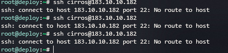
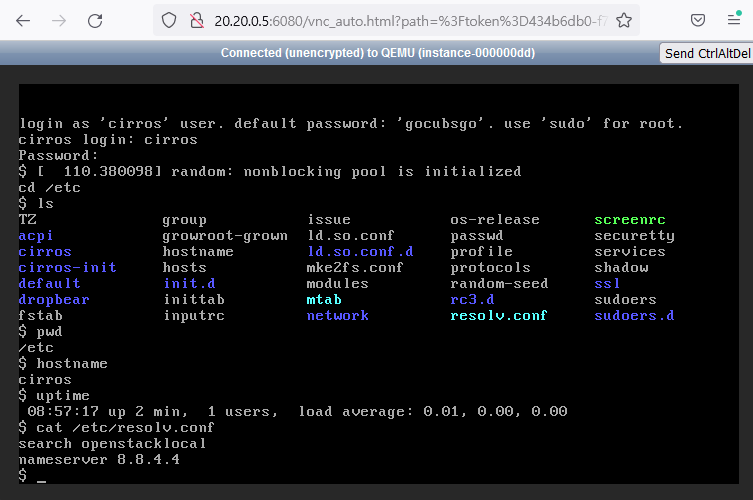

# Troubleshooting instance <-> External network failure issue ( DVR, with fip )

직접 구성한 DVR 구조의 오픈스택에서 인스턴스에 공인 아아피로 ssh가 안되는 문제가 발생했다.&#x20;

콘솔로는 로그인이 되기 때문에 인스턴스 생성 자체에는 이상이 없고 네트워크 이슈로 추측이 되었다.&#x20;

관련하여 트러블슈팅을 한 일련의 과정(=삽질기..)를 정리해 보고자 한다.

<div align="left">

<figure><figcaption></figcaption></figure>

</div>

<div align="left">

<figure><figcaption></figcaption></figure>

</div>


## 대상 인스턴스

다음 인스턴스를 대상으로 트러블슈팅을 진행하였다. wglee-compute-002에 스케줄링 된 인스턴스이다.

```shell-session
root@wglee-controller-001:~# openstack server show  1a3be680-daf7-4f29-9413-9467bf148c8f
+-------------------------------------+----------------------------------------------------------+
| Field                               | Value                                                    |
+-------------------------------------+----------------------------------------------------------+
| OS-DCF:diskConfig                   | MANUAL                                                   |
| OS-EXT-AZ:availability_zone         | nova                                                     |
| OS-EXT-SRV-ATTR:host                | wglee-compute-002                                        |
| OS-EXT-SRV-ATTR:hypervisor_hostname | wglee-compute-002                                        |
| OS-EXT-SRV-ATTR:instance_name       | instance-00000110                                        |
| OS-EXT-STS:power_state              | Running                                                  |
| OS-EXT-STS:task_state               | None                                                     |
| OS-EXT-STS:vm_state                 | active                                                   |
| OS-SRV-USG:launched_at              | 2023-02-15T16:07:58.000000                               |
| OS-SRV-USG:terminated_at            | None                                                     |
| accessIPv4                          |                                                          |
| accessIPv6                          |                                                          |
| addresses                           | dvr3-net=192.168.0.204, 183.10.10.142                    |
| config_drive                        |                                                          |
| created                             | 2023-02-15T16:07:48Z                                     |
| flavor                              | m1.nano (0)                                              |
| hostId                              | b36271e4182a9d39c85b69601c9454c91ca5388864a4261b96a0c3f2 |
| id                                  | 1a3be680-daf7-4f29-9413-9467bf148c8f                     |
| image                               | cirros-ceph1 (4bee1f98-5441-41c3-8701-d8e6f9d483de)      |
| key_name                            | dvr3-key                                                 |
| name                                | dvr3-demo8                                               |
| progress                            | 0                                                        |
| project_id                          | feaf6d4b8b8745fb9c955389675ef5d5                         |
| properties                          |                                                          |
| security_groups                     | name='default'                                           |
| status                              | ACTIVE                                                   |
| updated                             | 2023-02-15T16:07:58Z                                     |
| user_id                             | 056f5eae75f341978292543d007acd83                         |
| volumes_attached                    |                                                          |
+-------------------------------------+----------------------------------------------------------+
```


## Compute 노드 br-ex 구간

인스턴스에 ssh 접속을 시도한 deploy 서버에서 공인 아이피의 map에 대해 arp response를 받아왔는지 우선 확인해 보았다.&#x20;

정상이라면 183.10.10.182 처럼 "network:floatingip" 포트에 대한 mac address를 받아와야 하는데 imcomplete 상태이다.

```shell-session
root@deploy:~# arp -a | grep 117
? (183.10.10.117) at <incomplete> on ens3
root@deploy:~# arp -a | grep 182
? (183.10.10.182) at fa:16:3e:96:e6:97 [ether] on ens3
```


compute 노드로 넘어와서 인스턴스가 외부 인터넷 통신을 할 때 사용하는 ens3 인터페이스를 확인한다. ( Service Network에 해당 )&#x20;

원인 발견..! ens3 에 ovs port가 연결 안되어 있으며, br-ex 브릿지가 없다.&#x20;

여기서 openvswitch로 구성된 br-ex 는 인스턴스가 공인 아이피를 가지고 외부로 나갈 때 사용하는 external 브릿지이다.&#x20;

모든 compute node에서 br-ex ovs 브릿지를 생성하고, ens3 과 연결한다.

```shell-session
root@wglee-compute-001:~# ovs-vsctl add-br br-ex
root@wglee-compute-001:~# ovs-vsctl add-port br-ex ens3
root@wglee-compute-002:~# ovs-vsctl add-br br-ex
root@wglee-compute-002:~# ovs-vsctl add-port br-ex ens3
```


이제 ovs-vsctl list-br 명령어로 3개의 브릿지를 확인할 수 있다.

```shell-session
root@wglee-network-001:~# ovs-vsctl list-br
br-ex
br-int
br-tun
root@wglee-compute-002:~# ovs-vsctl list-br
br-ex
br-int
br-tun
```


ens3 에서도 이제 ovs-system 정보를 확인할 수 있음.

```shell-session
# wglee-compute-001
2: ens3: <BROADCAST,MULTICAST,UP,LOWER_UP> mtu 1500 qdisc fq_codel master ovs-system state UP group default 
qlen 1000
 link/ether 52:54:00:aa:b0:2b brd ff:ff:ff:ff:ff:ff
 inet 183.10.10.30/24 brd 183.10.10.255 scope global ens3
 valid_lft forever preferred_lft forever
 inet6 fe80::5054:ff:feaa:b02b/64 scope link
 valid_lft forever preferred_lft forever
# wglee-compute-002
2: ens3: <BROADCAST,MULTICAST,UP,LOWER_UP> mtu 1500 qdisc fq_codel master ovs-system state UP group default 
qlen 1000
 link/ether 52:54:00:de:d8:c8 brd ff:ff:ff:ff:ff:ff
 inet 183.10.10.31/24 brd 183.10.10.255 scope global ens3
 valid_lft forever preferred_lft forever
 inet6 fe80::5054:ff:fede:d8c8/64 scope link
 valid_lft forever preferred_lft forever
```


이제 공인 아이피의 mac address를 받아온 것을 확인했다.

```shell-session
root@deploy:~# ssh cirros@183.10.10.142
^C
root@deploy:~# arp -a | grep 183.10.10.142
? (183.10.10.142) at fa:16:3e:4b:08:5c [ether] on ens3
```


## Compute 노드  qrouter <-> 인스턴스 구간

하지만 여전히 ssh가 되지 않는다.&#x20;

compute 노드에서 snat, dnat가 이뤄지는 qrouter에 iptables 룰이 제대로 들어갔는지 확인해 보았다.&#x20;

neutron-l3-agent-PREROUTING, neutron-l3-agent-float-snat 체인을 확인하면 정상적으로 들어가 있다.

```shell-session
root@wglee-compute-002:~# iptables -nL neutron-openvswi-if1008856-2 -v
Chain neutron-openvswi-if1008856-2 (1 references)
 pkts bytes target     prot opt in     out     source               destination
    0     0 RETURN     all  --  *      *       0.0.0.0/0            0.0.0.0/0            state RELATED,ESTABLISHED /* Direct packets associated with a known session to the RETURN chain. */
    0     0 RETURN     udp  --  *      *       0.0.0.0/0            192.168.0.204        udp spt:67 dpt:68
    0     0 RETURN     udp  --  *      *       0.0.0.0/0            255.255.255.255      udp spt:67 dpt:68
    0     0 RETURN     all  --  *      *       0.0.0.0/0            0.0.0.0/0            match-set NIPv45afe811b-4121-4c0e-88b9- src
    0     0 DROP       all  --  *      *       0.0.0.0/0            0.0.0.0/0            state INVALID /* Drop packets that appear related to an existing connection (e.g. TCP ACK/FIN) but do not have an entry in conntrack. */
  332 27624 neutron-openvswi-sg-fallback  all  --  *      *       0.0.0.0/0            0.0.0.0/0            /* Send unmatched traffic to the fallback chain. */
 
root@wglee-compute-002:~# iptables -nL neutron-openvswi-of1008856-2 -v
Chain neutron-openvswi-of1008856-2 (2 references)
 pkts bytes target     prot opt in     out     source               destination
    0     0 RETURN     udp  --  *      *       0.0.0.0              255.255.255.255      udp spt:68 dpt:67 /* Allow DHCP client traffic. */
    0     0 neutron-openvswi-sf1008856-2  all  --  *      *       0.0.0.0/0            0.0.0.0/0
    0     0 RETURN     udp  --  *      *       0.0.0.0/0            0.0.0.0/0            udp spt:68 dpt:67 /* Allow DHCP client traffic. */
    0     0 DROP       udp  --  *      *       0.0.0.0/0            0.0.0.0/0            udp spt:67 dpt:68 /* Prevent DHCP Spoofing by VM. */
    0     0 RETURN     all  --  *      *       0.0.0.0/0            0.0.0.0/0            state RELATED,ESTABLISHED /* Direct packets associated with a known session to the RETURN chain. */
    0     0 RETURN     all  --  *      *       0.0.0.0/0            0.0.0.0/0
    0     0 DROP       all  --  *      *       0.0.0.0/0            0.0.0.0/0            state INVALID /* Drop packets that appear related to an existing connection (e.g. TCP ACK/FIN) but do not have an entry in conntrack. */
    0     0 neutron-openvswi-sg-fallback  all  --  *      *       0.0.0.0/0            0.0.0.0/0            /* Send unmatched traffic to the fallback chain. */
root@wglee-compute-002:~#
 
 
root@wglee-compute-002:~# iptables -nL neutron-openvswi-sg-fallback -v
Chain neutron-openvswi-sg-fallback (12 references)
 pkts bytes target     prot opt in     out     source               destination
  996 82872 DROP       all  --  *      *       0.0.0.0/0            0.0.0.0/0            /* Default drop rule for unmatched traffic. */
```


qrouter 에서 사설 아이피 192.168.0.204로 ping 을 보내면서 tcpdump를 걸어뒀을 때 response가 오지 않는다.&#x20;

qrouter로 들어온 패킷은 br-int와 linux bridge(qbr) 를 이어주는 veth pair를 통해서 리눅스 브릿지 인터페이스인 qbrf1008856-26에 도달하고, 가상서버의 tap 디바이스를 거처 인스턴스로 들어가게 된다.

지금 요청은 가지만 가상서버로부터 응답이 안 오기 때문에 tap 디바이스에 적용된 방화벽을 의심해 볼 수 있다.

```shell-session
root@wglee-compute-002:~# ip netns exec qrouter-6f774e8e-b42c-42dc-85ce-1ffac2d2d8bc tcpdump -i qr-56c70d72-3b
tcpdump: verbose output suppressed, use -v or -vv for full protocol decode
listening on qr-56c70d72-3b, link-type EN10MB (Ethernet), capture size 262144 bytes
^C14:41:58.497006 IP 192.168.0.1 > 192.168.0.204: ICMP echo request, id 24412, seq 3, length 64
14:41:59.498468 IP 192.168.0.1 > 192.168.0.204: ICMP echo request, id 24412, seq 4, length 64
14:42:00.513419 IP 192.168.0.1 > 192.168.0.204: ICMP echo request, id 24412, seq 5, length 64
14:42:01.537015 IP 192.168.0.1 > 192.168.0.204: ICMP echo request, id 24412, seq 6, length 64
14:42:02.561004 IP 192.168.0.1 > 192.168.0.204: ICMP echo request, id 24412, seq 7, length 64
5 packets captured
5 packets received by filter
0 packets dropped by kernel
```


참고로 해당 가상서버의 사설 아이피에 대한 port 의 uuid 로 검색한 linux bridge 와 브릿지에 연결된 인터페이스들은 아래와 같다.

```shell-session
root@wglee-controller-001:~# openstack port list | grep 192.168.0.204
| f1008856-26c0-4b94-9202-66c9947cb158 |      | fa:16:3e:a2:e3:47 | ip_address='192.168.0.204', subnet_id='94728f0f-d6e3-4978-948a-a51085a0e6a5' | ACTIVE |
 
root@wglee-compute-002:~# brctl show | grep f1008856
qbrf1008856-26          8000.ce8d1f482b05       no              qvbf1008856-26
                                                        tapf1008856-26
```


cli로 연결한 방화벽이 compute 노드에 실제로 적용 되어 있는지 확인한다.

가상서버의 사설 아이피 포트의 오픈스택 uuid에서 앞의 9자리로 검색하면 된다.&#x20;

( if1008856-2 -> inbound / of1008856-2 -> outbound )&#x20;

아니나 다를까, 패킷이 inbound에 해당하는 neutron-openvswi-if1008856-2 체인에서 fallback target으로 가서 다 drop 되고 있다.

```shell-session
root@wglee-compute-002:~# iptables -nL neutron-openvswi-if1008856-2 -v
Chain neutron-openvswi-if1008856-2 (1 references)
 pkts bytes target     prot opt in     out     source               destination
    0     0 RETURN     all  --  *      *       0.0.0.0/0            0.0.0.0/0            state RELATED,ESTABLISHED /* Direct packets associated with a known session to the RETURN chain. */
    0     0 RETURN     udp  --  *      *       0.0.0.0/0            192.168.0.204        udp spt:67 dpt:68
    0     0 RETURN     udp  --  *      *       0.0.0.0/0            255.255.255.255      udp spt:67 dpt:68
    0     0 RETURN     all  --  *      *       0.0.0.0/0            0.0.0.0/0            match-set NIPv45afe811b-4121-4c0e-88b9- src
    0     0 DROP       all  --  *      *       0.0.0.0/0            0.0.0.0/0            state INVALID /* Drop packets that appear related to an existing connection (e.g. TCP ACK/FIN) but do not have an entry in conntrack. */
  332 27624 neutron-openvswi-sg-fallback  all  --  *      *       0.0.0.0/0            0.0.0.0/0            /* Send unmatched traffic to the fallback chain. */
 
root@wglee-compute-002:~# iptables -nL neutron-openvswi-of1008856-2 -v
Chain neutron-openvswi-of1008856-2 (2 references)
 pkts bytes target     prot opt in     out     source               destination
    0     0 RETURN     udp  --  *      *       0.0.0.0              255.255.255.255      udp spt:68 dpt:67 /* Allow DHCP client traffic. */
    0     0 neutron-openvswi-sf1008856-2  all  --  *      *       0.0.0.0/0            0.0.0.0/0
    0     0 RETURN     udp  --  *      *       0.0.0.0/0            0.0.0.0/0            udp spt:68 dpt:67 /* Allow DHCP client traffic. */
    0     0 DROP       udp  --  *      *       0.0.0.0/0            0.0.0.0/0            udp spt:67 dpt:68 /* Prevent DHCP Spoofing by VM. */
    0     0 RETURN     all  --  *      *       0.0.0.0/0            0.0.0.0/0            state RELATED,ESTABLISHED /* Direct packets associated with a known session to the RETURN chain. */
    0     0 RETURN     all  --  *      *       0.0.0.0/0            0.0.0.0/0
    0     0 DROP       all  --  *      *       0.0.0.0/0            0.0.0.0/0            state INVALID /* Drop packets that appear related to an existing connection (e.g. TCP ACK/FIN) but do not have an entry in conntrack. */
    0     0 neutron-openvswi-sg-fallback  all  --  *      *       0.0.0.0/0            0.0.0.0/0            /* Send unmatched traffic to the fallback chain. */
root@wglee-compute-002:~#
 
 
root@wglee-compute-002:~# iptables -nL neutron-openvswi-sg-fallback -v
Chain neutron-openvswi-sg-fallback (12 references)
 pkts bytes target     prot opt in     out     source               destination
  996 82872 DROP       all  --  *      *       0.0.0.0/0            0.0.0.0/0            /* Default drop rule for unmatched traffic. */
```


즉, sg 에 문제가 있다. 이전에는 잘 되던 방화벽이었는데 변경된 부분이 있는 것인지 확인해 본다.&#x20;

해당 가상서버에 연결된 방화벽은 해당 project 에 대한 default sg (5afe811b-4121-4c0e-88b9-50e9802aab1d) 이다.

```shell-session
root@wglee-controller-001:~# openstack security group list | grep feaf6d4b8b8745fb9c955389675ef5d5
| 5afe811b-4121-4c0e-88b9-50e9802aab1d | default | Default security group | feaf6d4b8b8745fb9c955389675ef5d5 | []   |
```


5afe811b-4121-4c0e-88b9-50e9802aab1d 방화벽의 룰은 아래와 같다.&#x20;

tcp 22 허용하는 룰이 없다.

```shell-session
root@wglee-controller-001:~# openstack security group rule list  5afe811b-4121-4c0e-88b9-50e9802aab1d
+--------------------------------------+-------------+-----------+-----------+------------+--------------------------------------+
| ID                                   | IP Protocol | Ethertype | IP Range  | Port Range | Remote Security Group                |
+--------------------------------------+-------------+-----------+-----------+------------+--------------------------------------+
| 427e7763-460a-4dfb-a496-3ce226f2b9f5 | None        | IPv4      | 0.0.0.0/0 |            | 5afe811b-4121-4c0e-88b9-50e9802aab1d |
| 9defe3ad-807a-4702-924b-cade9670ee5e | None        | IPv6      | ::/0      |            | 5afe811b-4121-4c0e-88b9-50e9802aab1d |
| a0a913c0-bfe7-4245-90dd-fb6ea2e34124 | None        | IPv6      | ::/0      |            | None                                 |
| e09cf28e-da5b-4979-abf1-477fee426e9f | None        | IPv4      | 0.0.0.0/0 |            | None                                 |
+--------------------------------------+-------------+-----------+-----------+------------+--------------------------------------+
```


확인해보니 처음에 가상서버를 만들때 sg를 uuid 가 아닌 이름으로 지정했었다.&#x20;

default 이름을 가진 방화벽이 project별로 여러개가 있기 때문에 원래 사용하던 ssh 22 허용된 방화벽이 아닌 해당 project에 신규로 생성된 방화벽이 적용된 듯 하다.

기존에 쓰던 ssh 룰이 있는 방화벽을 추가로 연결한다.

```shell-session
root@wglee-controller-001:~# openstack server add security group  1a3be680-daf7-4f29-9413-9467bf148c8f 5247df22-2d9a-4450-9370-f43043b2fa4f
 
root@wglee-controller-001:~# openstack security group rule list 5247df22-2d9a-4450-9370-f43043b2fa4f
+--------------------------------------+-------------+-----------+-----------+------------+--------------------------------------+
| ID                                   | IP Protocol | Ethertype | IP Range  | Port Range | Remote Security Group                |
+--------------------------------------+-------------+-----------+-----------+------------+--------------------------------------+
| 1fe4a079-718f-44b8-a49b-30065c2ad46f | icmp        | IPv4      | 0.0.0.0/0 |            | None                                 |
| 73df0fc5-4b72-4596-b98c-6587d507cf89 | None        | IPv6      | ::/0      |            | 5247df22-2d9a-4450-9370-f43043b2fa4f |
| 887a8da3-471c-4c63-bb70-45f339c0950e | tcp         | IPv4      | 0.0.0.0/0 | 22:22      | None                                 |
| 8bc1cb37-616a-4278-884f-75ed840cf40f | None        | IPv4      | 0.0.0.0/0 |            | None                                 |
| c78c7e8b-96d7-4895-9f7c-9ae85f60469a | None        | IPv6      | ::/0      |            | None                                 |
| ee1daf8c-6820-476b-90d6-e2c827814389 | None        | IPv4      | 0.0.0.0/0 |            | 5247df22-2d9a-4450-9370-f43043b2fa4f |
+--------------------------------------+-------------+-----------+-----------+------------+--------------------------------------+
```


이제 inbound 체인에 tcp 22 를 허용하는 룰이 들어간 것을 볼 수 있다.

```shell-session
root@wglee-compute-002:~# iptables -nL neutron-openvswi-if1008856-2 -v
Chain neutron-openvswi-if1008856-2 (1 references)
 pkts bytes target     prot opt in     out     source               destination
    0     0 RETURN     all  --  *      *       0.0.0.0/0            0.0.0.0/0            state RELATED,ESTABLISHED /* Direct packets associated with a known session to the RETURN chain. */
    0     0 RETURN     udp  --  *      *       0.0.0.0/0            192.168.0.204        udp spt:67 dpt:68
    0     0 RETURN     udp  --  *      *       0.0.0.0/0            255.255.255.255      udp spt:67 dpt:68
    0     0 RETURN     all  --  *      *       0.0.0.0/0            0.0.0.0/0            match-set NIPv45afe811b-4121-4c0e-88b9- src
    0     0 RETURN     icmp --  *      *       0.0.0.0/0            0.0.0.0/0
    0     0 RETURN     tcp  --  *      *       0.0.0.0/0            0.0.0.0/0            tcp dpt:22
    0     0 RETURN     all  --  *      *       0.0.0.0/0            0.0.0.0/0            match-set NIPv45247df22-2d9a-4450-9370- src
    0     0 DROP       all  --  *      *       0.0.0.0/0            0.0.0.0/0            state INVALID /* Drop packets that appear related to an existing connection (e.g. TCP ACK/FIN) but do not have an entry in conntrack. */
  332 27624 neutron-openvswi-sg-fallback  all  --  *      *       0.0.0.0/0            0.0.0.0/0            /* Send unmatched traffic to the fallback chain. */
```


## 결론 및 소감

이제 정상적으로 ssh 가 된다. 결국 security group 문제였다 ..^^&#x20;

비록 기존에 잘 쓰던 방화벽을 적용했다는 생각에 방화벽은 의심도 안하고 DVR 구성의 문제일 것이라고 생각해서 진행한 트러블슈팅이었다.&#x20;

하지만 이 기회로 DVR 구조에서 North <-> South 구간을 다시금 볼 수 있었던 것 같다.

```shell-session
root@deploy:~# ssh cirros@183.10.10.142
The authenticity of host '183.10.10.142 (183.10.10.142)' can't be established.
ECDSA key fingerprint is SHA256:5mfPtJZIMo71g2+ueafIbaMhrbcfbUdcFVm/Y9cHe3s.
Are you sure you want to continue connecting (yes/no/[fingerprint])? yes
Warning: Permanently added '183.10.10.142' (ECDSA) to the list of known hosts.
cirros@183.10.10.142's password:
$ echo "Hello!!!" > wglee.txt
$ cat wglee.txt
Hello!!!
$ cd /etc
$ ls
TZ              default         growroot-grown  inittab         ld.so.conf.d    network         protocols       screenrc        ssl
acpi            dropbear        hostname        inputrc         mke2fs.conf     os-release      random-seed     securetty       sudoers
cirros          fstab           hosts           issue           modules         passwd          rc3.d           services        sudoers.d
cirros-init     group           init.d          ld.so.conf      mtab            profile         resolv.conf     shadow
$
```


